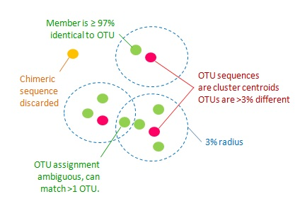

# Working with amplicon sequences {#amplicon-sequences}

## Introduction

Sequencing PCR products, amplicons, of a gene deemed as a good taxonomic marker is a very common
technique in microbial ecology. For Bacteria and Archaea, the gene that is almost always used is the
gene encoding the RNA molecule of the small subunit (SSU) of the ribosome, the 16S rRNA
[@lane_rapid_1985]. For other organism groups, other molecules, such as the end of the SSU rRNA gene
plus the following internal transcribed spacer (ITS), might be better choices.

The 16S gene has been selected as a taxonomical marker for several reasons:

1. It is present in all cellular organisms (although it's called 18S in eukaryotes).

2. It is believed to very rarely transfer horizontally between cells, which would entangle the
   relationships we rely on for taxonomy.

3. It contains both highly conserved and not so conserved regions. The latter, more variable
   regions, are numbered and called V1-V9 [see e.g. @chakravorty_detailed_2007]. The highly
   conserved regions are used as primer sites and the more variable are used to discriminate taxa.
   The variable regions are selected to form a product of suitable length for your sequencing
   method.

There are computer programs that facilitates design of primers [e.g. @hugerth_degeprime_2014], but
in practice a few region combinations with primers are used. In many Swedish research groups Anders
Andersson's primers for the V3V4 (around 400-450 bp; suitable for Illumina MiSeq 2x300 bp) are used
(see [lab protocol](https://github.com/EnvGen/LabProtocols)). Recently, the V4V5 region has been
proposed as a superior choice, in particular for its suitability for Archaea
[@walters_improved_2016] [@parada_marine_2017].

### Contamination and other problems {#amplicon-contamination}

In certain projects, usually those with very small amounts of DNA, we have observed problems with
contamination of DNA from reagents used in the processing of DNA from filters
[@salter_reagent_2014]. This is not unique for amplicon-based sequencing, but the amplification
performed inflates the problem. To address this, one should routinely sequence samples of pure water
that has gone through all the steps of the sample preparation process and subtract these sequences
from analyses.

@yeh_taxon_2017 recently published a report of a mysterious disapperance of certain taxa from a
sequencing run. They were able to resolv this problem as they routinely added a sample of a mock
community (just a defined mix of genomic DNA) to their sequencing runs.

## Computational analysis of amplicon sequences {#amplicon-bioinformatics}

Sequence reads are not perfect but contain errors. In the case of Illumina sequencing, the error
rate is around 1% per base, but this varies substantially along the length of the read and 
typically increases (i.e. quality goes down) by the end of the read. Just taking the raw sequencing
reads and treating them as true would hence inflate your measurement of diversity in the sample.
This problem has been addressed with clustering but correcting the reads has now become the method
of choice. I will here describe both methods, but note that the OTU clustering method is described
only for historical reasons and I do not recommend you to use it.

### "OTU" clustering {#otu-clustering}

"Operational taxonomic units" (OTUs) are replacements for species in many ecological studies where
species cannot be clearly delineated. In the case of prokaryotes, it's not only difficult to
delineate species [@koeppel_identifying_2008], we do not know what constitutes a species
[@cohan_what_2002], [@straub_null_2017] or even if prokaryotic species exist [e.g.
@caro-quintero_bacterial_2012]. However, a pragmatic species definition for Bacteria has long been
set to 70% DNA-DNA hybridization (DDH) [@tindall_notes_2010] which corresponds to 95-96% average
nucleotide identity [@konstantinidis_bacterial_2006] over the whole genome, or 98.65% 16S rRNA
identity [@kim_towards_2014]. 

To take care of sequencing errors and address the problem of species delineation, microbial
ecologists have clustered sequences, based on similarity, into OTUs, with a cutoff of typically 97%
identity to come close to species.

There are different clustering methods available, using different definitions of clusters.
*Complete linkage clustering* is perhaps the one that comes closest to many people's intuition. A
cluster in complete linkage cluster is a group of sequences where no pair are less than, say, 97%
identical^[This definition of complete linkage clustering is a bit simplified, but for the purpose
of clustering sequences, it captures the essence. See the [Wikipedia
page](https://en.wikipedia.org/wiki/Complete-linkage_clustering) for a fuller explanation.]. Because
of this defintion, all sequences need to be compared with each other, which is time consuming if you
have a lot of sequences as the number of comparisons, and hence run time grows as the square of the
number of sequences^[If you study the full algorithm, you will find that it's scaling even worse, as
the cube of the number of sequences.]. This characteristic makes complete linkage clustering, and
its "siblings" *single linkage clustering* and *average linkage clustering* impractical for use with
the amounts of sequences -- typically 10-20 million read pairs from one Illumina MiSeq run -- and
faster, *heuristic*^["Heuristic" computer algorithms are (usually) fast ways of solving complicated
problems, usually "known" to work but with no guarantee of reaching an optimal solution.] algorithms
are required.

One of the most commonly used heuristic algorithms for clustering sequences is the *greedy*^[A
greedy algorithm heuristic, is one which only looks at the optimum, at a particular point in time,
although at a later stage, this choice might prove suboptimal. See also the [Wikipedia
page](https://en.wikipedia.org/wiki/Greedy_algorithm).] UPARSE algorithm [@edgar_uparse:_2013], part
of the USEARCH package [@edgar_search_2010], but also in a free reimplentation as part of the
VSEARCH package [@rognes_vsearch:_2016].

The [UPARSE web page](https://drive5.com/usearch/manual/uparseotu_algo.html) describes the algorithm
well. In short, one starts with all sequences sorted in falling order of abundance, i.e. with the
most abundant first. The first sequence will be selected to form the *seed sequence* or *centroid*
of the first cluster. Starting with the second sequence, the process is the same for all: 1) Run
through all previously defined clusters and compare the current sequence with the seed sequence of
the clusters. 2) If a seed sequence that is sufficiently similar, assign the current sequence to
that cluster. 3) If no sufficiently similar seed sequence is found, assign the sequence as the seed
for a new cluster. The resulting clusters will look something like this:



Figure from the [UPARSE web
page](https://drive5.com/usearch/manual/uparseotu_algo.html).

### Correcting sequencing errors in amplicon reads {#amplicon-read-correction}

### Assigning taxonomy to amplicon sequences {#amplicon-taxonomy}

```{r include=FALSE}
# vim:tw=100
```
